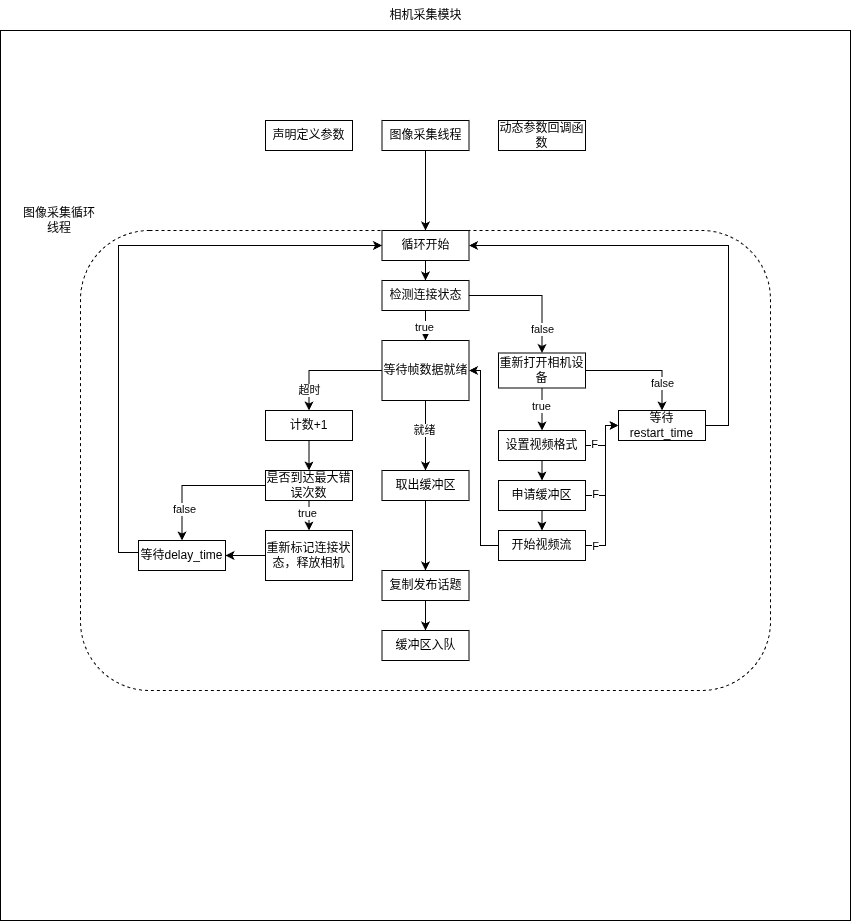

# usb_camera ROS 2 package

[](https://docs.ros.org/en/humble/)
[](https://releases.ubuntu.com/22.04/)
[](./package.xml)
[](https://github.com/adoreATRI/ATRI_usb_camera/commits)
[](https://wakatime.com/badge/github/adoreATRI/ATRI_usb_camera)

## 1. 项目介绍

### 1.1 项目简介

ATRI_usb_camera 是基于Linux V4L2接口的USB相机ROS2功能包，支持JPEG格式视频采集，相机后插和断线重连功能。

### 1.2 目录结构

```text
usb_camera/
├── config/
│   ├── camera_info.yaml  # 需替换成自身相机的标定参数
│   └── usb_camera_config.yaml
├── include/usb_camera/
│   └── usb_camera_node.hpp
├── launch/
│   └── launch.py
├── src/
│   └── usb_camera_node.cpp
├── CMakeLists.txt
└── package.xml
```

### 1.3 依赖

- ROS: [Humble](https://docs.ros.org/en/humble/Installation/Ubuntu-Install-Debs.html)
- Linux V4L2 设备支持

### 1.4 逻辑框架


## 2. 编译

```bash
colcon build --symlink-install --cmake-args -DCMAKE_BUILD_TYPE=Release
```

## 3. 参数配置

常用参数：

| 参数 | 说明 | 示例 |
| --- | --- | --- |
| `camera_device_v4l_url` | 相机设备路径，`/dev/v4l/by-id/` 下的稳定路径 | `/dev/v4l/by-id/...` |
| `camera_info_url` | 相机内参文件 URL | `package://usb_camera/config/camera_info.yaml` |
| `image_topic` | 压缩图像发布话题 | `usb_camera/image/compressed` |
| `camera_info_topic` | 相机内参发布话题 | `usb_camera/camera_info` |
| `frame_id` | 图像和内参消息使用的坐标系 | `camera_optical_frame` |
| `image_width` | 图像宽度 | `1280` |
| `image_height` | 图像高度 | `720` |
| `frame_rate` | 采集帧率 | `60` |
| `exposure_time_mode` | 曝光模式，`0` 通常表示手动曝光 | `0` |
| `exposure_time` | 曝光时间 | `170` |
| `brightness` | 亮度 | `60` |
| `contrast` | 对比度 | `50` |
| `saturation` | 饱和度 | `60` |

查看本机相机设备：

```bash
ls -l /dev/v4l/by-id/
```

## 4. 运行

- 将 `config/camera_info.yaml` 替换成自身相机的标定参数
- 在 `usb_camera_config.yaml` 中修改 `camera_device_v4l_url` 参数为对应的设备路径 或 在 launch.py 中通过参数传入

```bash
source install/setup.bash
ros2 launch usb_camera launch.py start_rviz:=true 

# 通过launch参数覆盖默认配置
ros2 launch usb_camera launch.py camera_path:=/dev/v4l/by-id/your_camera_device start_rviz:=true
```

## 5. 参数动态调整

部分 V4L2 控制参数支持运行时调整，例如:

```bash
# 查看当前参数
ros2 param get /usb_camera_node exposure_time

# 设置参数
ros2 param set /usb_camera_node exposure_time 170
ros2 param set /usb_camera_node brightness 60
ros2 param set /usb_camera_node contrast 50
ros2 param set /usb_camera_node saturation 60
```


